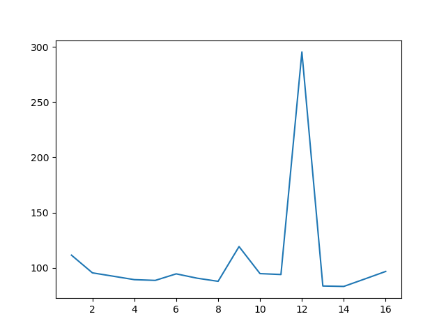

# WormStudio_XZMU

(徐州医科大学定制化线虫追踪和关键参数计算软件)

**@copyright: 小鲸灵(江苏)智能科技**

**@date: 2023/8/26**

**@version: 4.8.0_stable_XZMU**

**联系方式：**

- 电话：17696554803

- 咨询邮箱：jzy@smail.nju.edu.cn

@TODO: 整理代码

- 采用YOLOX检测器和7_25服务器训练得到的参数

- 进行简化，删去所有在集成系统中不必要的代码

- 进行了并行计算实验，然而发现总计算时间和`batch_size`的关系实际并不是很大，在一些特定数值情况下甚至更大，因此取消该功能

  

- 将所有关键参数用`config_dict`打包

  ```python
  detector = YOLO(cuda=config_dict['cuda'])
  ```

- `dectector`模块引出并仅可调用接口函数`mot_detect`，该函数接收视频地址，并返还MOT格式的检测数据文件

  ```python
  def mot_detect(config_dict, input_video_path='', txt_result_path=''):
      """
      Params:
      input_video_path - 输入视频路径
      txt_result_path - txt格式缓存结果保存路径
      """
      detector = YOLO(cuda=config_dict['cuda'])
      cv2_video_obj = cv2.VideoCapture(input_video_path)
      frame_id = 1
      with open(txt_result_path, 'w') as f:
          while True:
              ret, frame = cv2_video_obj.read()
              if not ret:
                  break
              bboxes = detector.detect(frame)
              if bboxes is not None:
                  for (x1, y1, x2, y2) in bboxes:
                      """
                      MOT format: <frame>, <id>, <bb_left>, <bb_top>, <bb_width>, <bb_height>, <conf>, <x>, <y>, <z>
                      """
                      f.write(f'%d,%d,%.2f,%.2f,%.2f,%.2f,1,-1,-1,-1' % (frame_id, -1, x1, y1, x2-x1, y2-y1)+'\n')
              frame_id += 1
      f.close()
      cv2.destroyAllWindows()
      cv2_video_obj.release()
  ```

- 采用SORT追踪框架，引用并仅可调用`mot_track`，该函数接收检测序列文件地址，返还MOT格式的追踪数据文件

- 轨迹优化函数引用并仅可调用`mot_optimize`，该函数接收追踪序列文件地址，返还MOT格式的优化后数据文件

